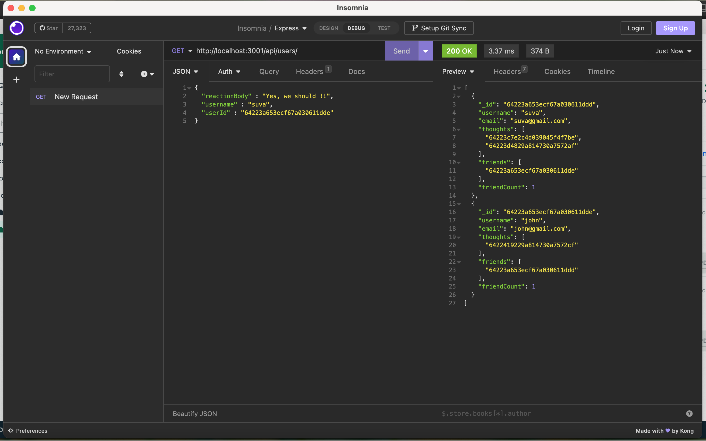
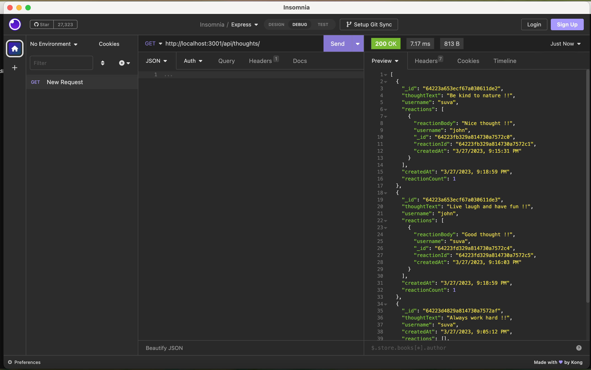

# social-network-API

## Description 

This is an API for a social network web application with NoSQL database where users can share their thoughts, react to friends’ thoughts, and create a friend list. This application uses Express.js for routing, a MongoDB database, and the Mongoose ODM.

The application can be invoked by using 'node index.js' command. 

* When you invoke the application with 'node index.js' then the server is started and Mongoose models are synced to the Mongo DB database.
* When you open API GET routes in Insomnia for users and thoughts then the data for each of these routes is displayed in a formatted JSON.
* When you test API POST, PUT, and DELETE routes for users and thoughts in Insomnia then you can successfully create, update, and delete users and thoughts in the database. Whenever you delete a user then all the associated thoughts will also be deleted.
* When you test API POST and DELETE routes in Insomnia for reactions to thoughts then you can successfully create and delete reactions to thoughts.
* You can also add or remove friends to a user’s friend list. 

## Features

* The features are same as explained in the description, please refer above.

## Installation

N/A

## Screenshot

* Please see two sample screenshots below

## Link to the GitHub repo of the application

## Link to the walkthrough video demonstrating the functionality of the application

## Credits

* Our TA, Sebastian Fave for helping in resolving homework related doubts. 
